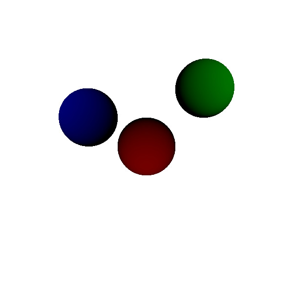
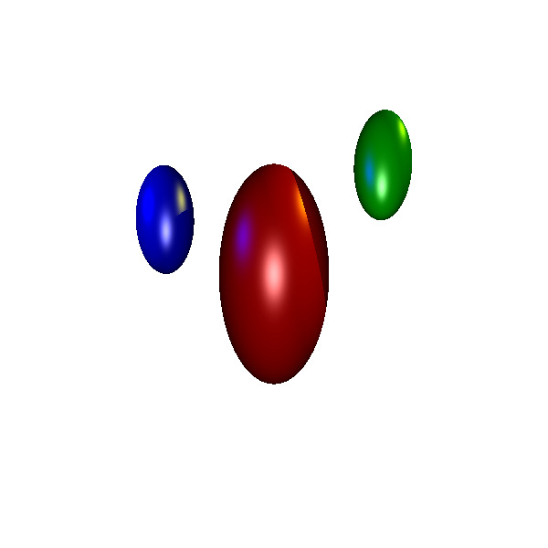
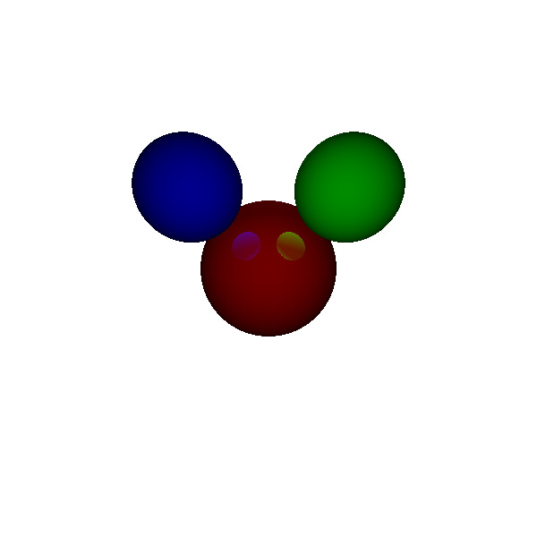
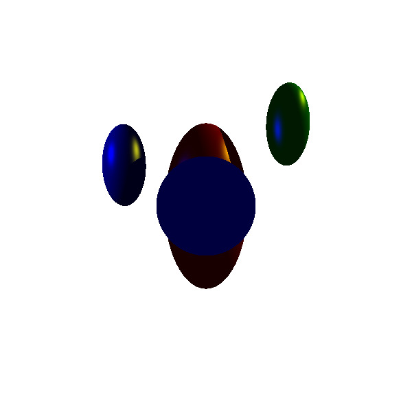
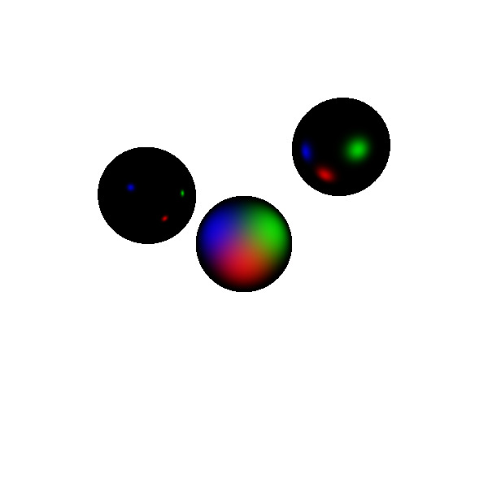

# C++ Ray tracer
A custom ray tracer built with C++ and Visual Studio Code that parses scene description files and render 3D objects using STL, affine matrices, and matrix inversion to support ellipsoid transformations, with various rendering features and visual effects including ambient/diffuse lighting, shadows, reflections, near-plane clipping, anti-artifact handling, and recursive ray calculations to enable generation of scenes with complex visual behaviors.

## Example Usage
- In CMD, navigate to the location of raytrace.cpp.

- Compile: cl raytrace.cpp /FeRayTracer.exe

- Run:     RayTracer.exe testAmbient.txt           

- Output:  testAmbient.ppm

Dependencies: None (standard C++ STL only)

## Features
- Perspective camera with user-defined image plane (LEFT, RIGHT, BOTTOM, TOP, NEAR)
- Resolution control via RES keyword
- Full scene parsing from input file (supports SPHERE, LIGHT, AMBIENT, BACKGROUND, OUTPUT)
- Multiple light sources with color and position
- Ray-sphere intersection with support for arbitrary ellipsoid scaling
- Use of homogeneous transformation matrices (M) and their inverses (M⁻¹)
- Ray transformation from world space to object space using M⁻¹ for intersection
- Normal transformation from object space to world space using M⁻¹ (ignores translation)
- Normal flipping when the ray starts inside the sphere
- Ambient, diffuse, and Phong specular lighting (per-light source)
- Shadow computation (includes soft skip when light ray originates inside a sphere)
- Reflections with recursive tracing up to a configurable depth (depth <= 3)
- Output image saved in P3 (ASCII) PPM format
- Near-plane clipping to approximate hollow objects or prevent artifacts
- Custom scaling factors (kr patching) to reduce unrealistic reflection intensity
- Efficient matrix inversion via adjoint and determinant functions
- Prevents self-shadowing artifacts using ray origin offset (epsilon = 1e-4)

## Screenshots
### Diffuse  

### Parsing  

### Reflection  

### Illum  

### Specular  

## Tech Stack
- C++
- STL
- Visual Studio Code
